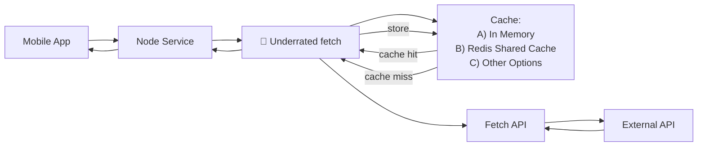

# 🐶 Underrated-fetch


[](https://www.npmjs.com/package/@jmus/underrated-fetch)
[](https://www.npmjs.com/package/@jmus/underrated-fetch)
[](LICENSE)


A simple **Node.js** wrapper around `fetch` that adds **TTL-based caching** for **JSON REST APIs**.

Designed to reduce redundant outbound requests and avoid rate limits when calling external APIs.

### Example usage



---

## Why?

External APIs often have:
- Rate limits
- Latency
- Usage quotas

If your app repeatedly calls the same endpoint, `underrated-fetch` caches responses and reuses them until they expire.

---

## Features

- ✅ Caches JSON responses
- ✅ TTL-based expiration
- ✅ Per-request TTL overrides
- ✅ Built-in in-memory LRU cache
- ✅ Pluggable cache stores (Redis, DB, etc.)
- ✅ Cache hit / miss hooks for metrics

---

## Non-Goals

- ❌ Full HTTP caching (no `Cache-Control`, `ETag`, `Vary`, etc.)
- ❌ Cross-process caching by default
- ❌ Browser usage
- ❌ Encryption of cached data

---

## Platform

- Node.js 18+
- Server-side usage only
- Works in any Node environment (Express, Fastify, NestJS, cron jobs, workers)

---

## Installation

```bash
npm install underrated-fetch
```

---

## Quick Start

```ts
import { createCachedFetch } from 'underrated-fetch';

const cachedFetch = createCachedFetch({ timeToLive: 60_000 });

// Works like fetch, but cached
const user = await cachedFetch('https://api.example.com/users/123');
const same = await cachedFetch('https://api.example.com/users/123'); // cache hit
```

Cache keys are automatically derived from the URL path and query:

```
https://api.example.com/users/123     → /users/123
https://api.example.com/search?q=foo  → /search?q=foo
```

---

## API

### `createCachedFetch<T>(options)`

Creates a cached fetch function.

```ts
const cachedFetch = createCachedFetch({
  timeToLive: 60_000,                    // Required: default TTL (ms)
  store: customStore,                    // Optional: custom cache store
  memoryStoreOptions: { maxSize: 5000 }, // Optional: configure memory store
  shouldCache: (data) => true,           // Optional: conditionally cache
  onHitCallback: (key) => {},            // Optional: called on cache hit
  onMissCallback: (key) => {},           // Optional: called on cache miss
});
```

---

### Per-request TTL

```ts
await cachedFetch('https://api.example.com/data');                 // default TTL
await cachedFetch('https://api.example.com/live', { timeToLive: 5_000 });
```

---

## Storage

### Default: in-memory LRU cache

By default, `underrated-fetch` uses an **in-process LRU (Least Recently Used)** memory cache.

```ts
const cachedFetch = createCachedFetch({
  timeToLive: 60_000,
  memoryStoreOptions: {
    maxSize: 1000, // default
    onEvictCallback: (key) => {
      console.log(`Evicted: ${key}`);
    },
  },
});
```

> ⚠️ The default store is **not shared across processes or servers**.

---

### Custom stores (Redis, databases, etc.)

Implement the `CacheStore<T>` interface:

```ts
interface CacheStore<T> {
  get(key: string): Promise<CacheEntry<T> | undefined>;
  set(key: string, entry: CacheEntry<T>): Promise<void>;
  delete(key: string): Promise<void>;
  clear(): Promise<void>;
  has(key: string): Promise<boolean>;
}
```

Then provide it:

```ts
const cachedFetch = createCachedFetch({
  timeToLive: 60_000,
  store: myStore,
});
```

See `examples/redis-store.ts` for a complete Redis implementation.

---

## Conditional Caching

```ts
const cachedFetch = createCachedFetch({
  timeToLive: 60_000,
  shouldCache: (data) => data.status === 'success',
});
```

---

## Observability

```ts
const cachedFetch = createCachedFetch({
  timeToLive: 60_000,
  onHitCallback: () => metrics.increment('cache.hit'),
  onMissCallback: () => metrics.increment('cache.miss'),
});
```

---

## Security

⚠️ Cached data is **not encrypted**.

Do **not** cache:
- API keys or authentication tokens
- Passwords or credentials
- Personally identifiable information (PII)

---

## When should I use this?

Use `underrated-fetch` if you:
- Call third-party REST APIs from Node.js
- Want simple, predictable caching
- Need to reduce rate-limit pressure
- Prefer explicit TTLs over HTTP cache headers

---

## Requirements

- Node.js 18+
- ES2020+

---

## License

MIT